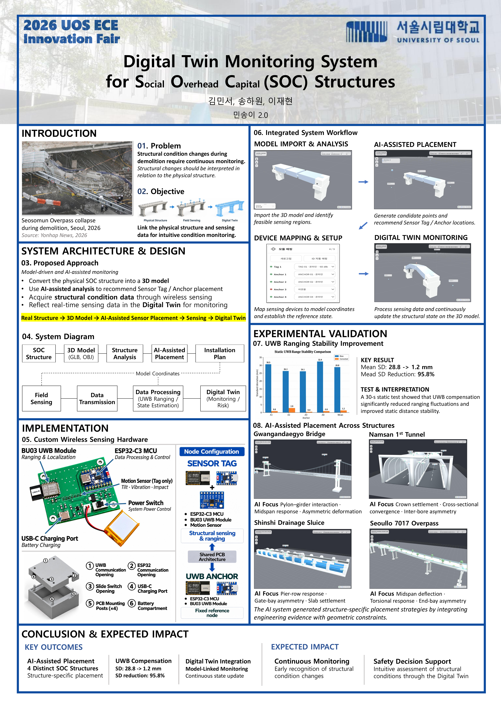

# Structural Digital Twin Monitoring System

## Overview

This project develops a real-time structural monitoring system based on digital twin technology. It integrates 3D structural modeling, AI-assisted sensor placement, wireless sensing, and state estimation to monitor structural displacement and visualize condition changes in a digital twin environment.

**Team Project (3 members)**  
**Excellence Award (3rd of 29 teams)** — 2026 UOS ECE Innovation Fair

My primary contributions were sensor-module hardware/PCB design and UWB localization improvements. AI-assisted sensor placement and 3D model processing were primarily handled by teammates.

## My Role

- Designed the sensor-module hardware and PCB
- Integrated ESP32-C3, BU03 UWB module, and ADXL345 accelerometer
- Improved the UWB-based localization algorithm
- Participated in experimental validation and ranging/localization data analysis

## Key Improvements

- Replaced incremental displacement accumulation with absolute position re-estimation
- Added initial range-bias calibration and outlier rejection
- Reduced stationary position-estimate fluctuation to approximately ±10 mm
- Added motion-triggered UWB revalidation using accelerometer events

## Results & Limitations

**Static UWB Ranging Stability**
- In a 30-second static test, the mean standard deviation of UWB range measurements decreased from 28.8 mm to 1.2 mm after compensation.
- This represents a 95.8% reduction in measured ranging fluctuations.

**Position Estimation**
- Reduced stationary position-estimate fluctuation to approximately ±10 mm.
- Enabled displacement tracking through absolute position re-estimation.

**Limitations**
- The reported static results characterize measurement and estimation stability, not absolute localization accuracy.
- Dynamic displacement estimation accuracy remains under improvement and requires further validation.

## System Components

- ESP32-C3 microcontroller
- Ai-Thinker BU03 (DW3000-based UWB module)
- ADXL345 three-axis accelerometer
- UWB anchors and sensor tags
- Web-based digital twin monitoring interface

## Project Poster

